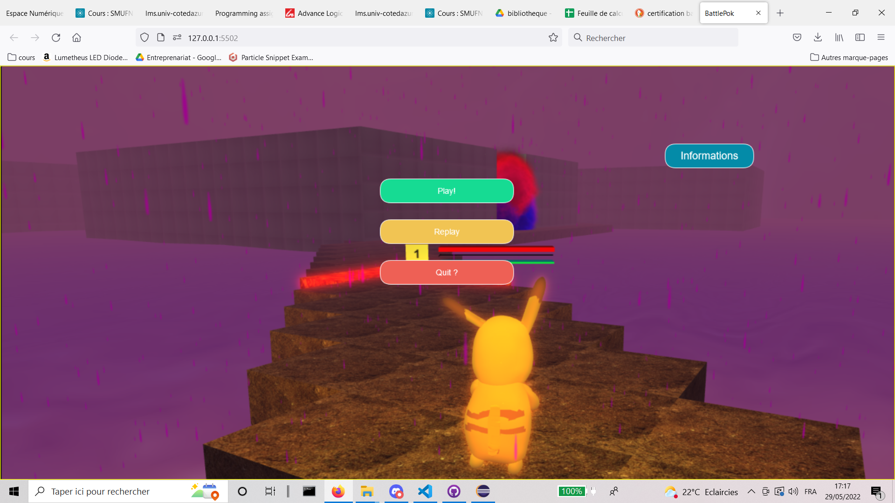
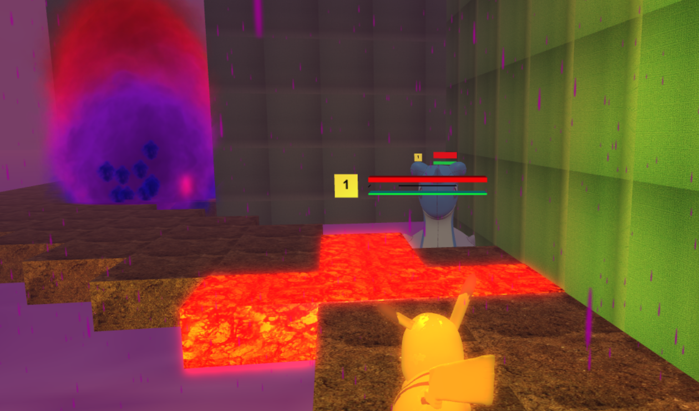
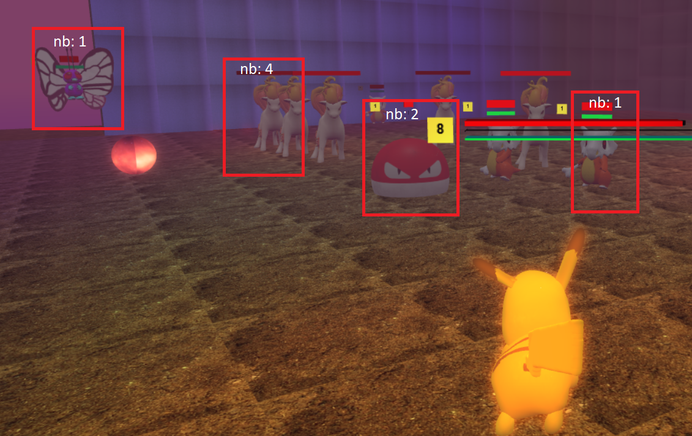
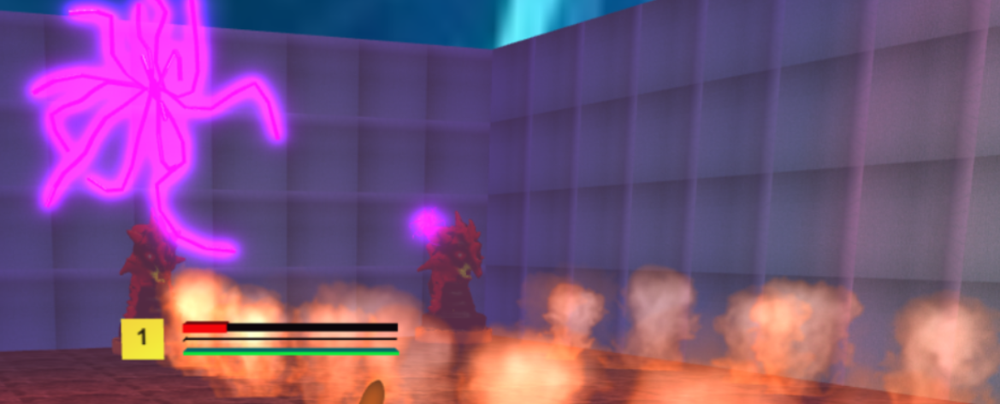
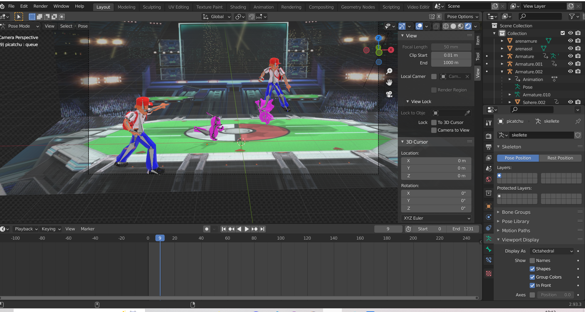
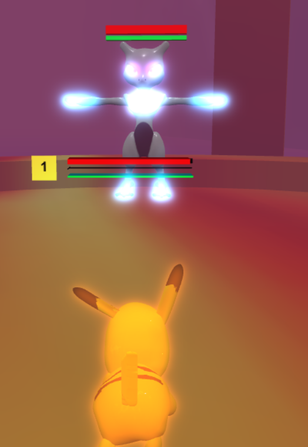

                        # BattlePoc
                    Game Concours Babylonjs

Créateurs:
Matthis Kuhl, Ahmed El Hanafi Si Dehbi

Concept de jeu:

Le jeu s'inspire du monde pokemon. C'est un jeu mode un joueuer et vous étez pikatchu vous devez vous battre contre les autres pokemon et sur tous contre le redutable pokemon et boss Mewtwo.
La map est générer aléatoirement avec un algorithme reliant les salles positioner au hasard avec des chemins.
Il y a plusieurs type de salle et d'enemy qu'on peut retrouver les salles ce recharge à chaque fois que vous y entrer de dans.
De plus la difficulté des salles augemante avec le gain de niveau.

L'histoire:

Nous jouant dans un monde ou Miewtwoo à décidé de faire disparaitre tous les humain sur terre et de les éffacés de la mémoires des pokemons. Picatchu est le dernier à avoir des souvenirs et ce met à la concete au but du retour des Humains.
Bien que les autres pokemons et leurs environement vont rendre cette conquete difficile arrivera-t-il à c'est fin?
C'est à vous de sauver ce monde.

Réggle de jeut:
Il ne faut pas résté dans l'eau si non on perdra vite connaisance.
Le but est de battre les autres pokemons affin de gagner en experiance pour avoir une chance contre le boss mewtwo qui ce trouve à l'autre coté de la map.

Conception de jeu:

Creation de la map:

Exterieure:

Salle et Ennemi:

Lumiere:

Mesh et video:

Boss:

Pour les meshes une partie et récuperer sur internet cgtrader.com/ puis souvent repain  puis skeletisé et animé en blender par nous meme.*
Puis exporté.
Les points les plus difficile etais la lumiere les exportation importation les chutes de frames à cause de beaucoup de mesh donc il fallais rechargé les salles et deschargé les enemis etc.